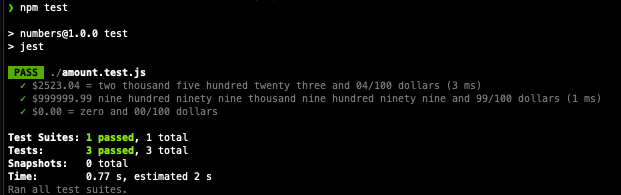

# Exercise 3 
Write some code that will accept a $ amount and convert it to the appropriate string representation.
Example:
Convert
$2523.04
to "Two thousand five hundred twenty-three and 04/100
dollars"

# Disclaimer
Restrictions:
1. Input must be a string. Format: $xxxx.xx
2. Valid amounts from $0.00 to $999999.99

Project uses recursion.

# Dependencies
Project uses: 
- Node v16
- Jest for unit test.

# Install
```sh
npm i
```
# Execution
```sh
npm test
```
# Output
